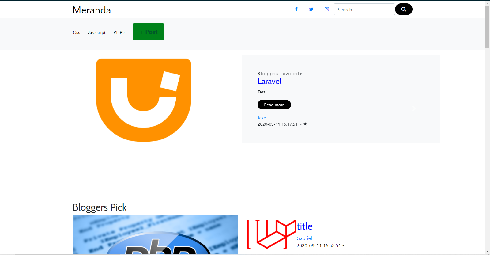
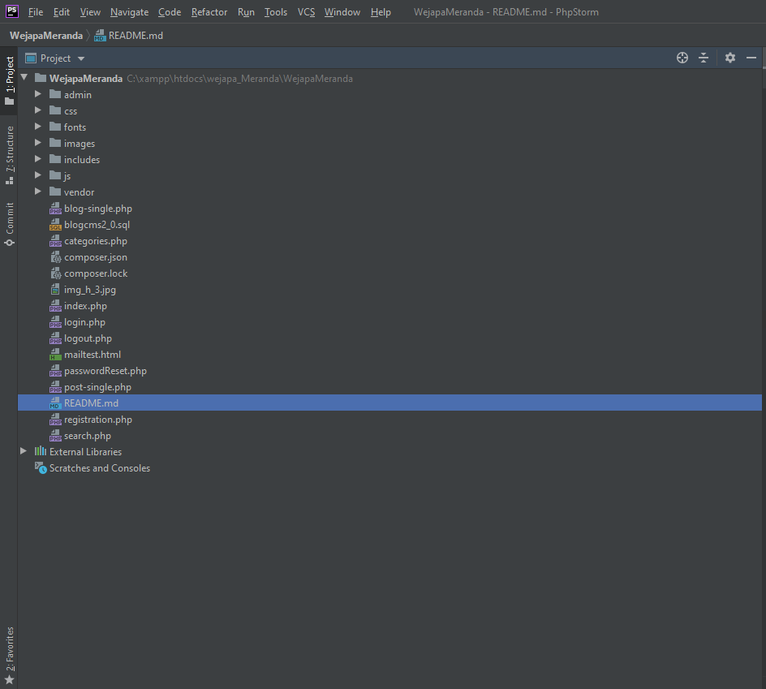

<b>Meranda</b>
 
This is a blog site with more than one content creator and a super admin,
User can create an account and create contents of their own and publish 
on the site pages

<b>Motivation</b>
 
This was made to fulfill the final test for Wejapa internship project and to test how independent I am now.

<b>Code style</b>
 
The system follows a very basic code style,having page contents in the root folder,needed functions, processors and common files(header,footer,sidebar) in the includes folder,
style sheets in a css folder and javascript in a js folder.

<b>Screenshots</b>
 
Index page:

   

Code Structure:

<b>TECH</b>
 
1) HTML
2) Bootstrap
3) CSS
4) Javascript(Jquery)
5) PHP

<b>Features</b>
 
The system offers a compact and concise user, admin view
within a few pages ,allowing as many users(writers) as possible
to create contents and either publish immediately or save for 
later dates to publish(like a draft).

<b>Installation</b>
 
Follow this steps to run the software.

1. Clone repo into your local servers,www directory(wampp) or htdocs (xampp),
2. user has to have a local server(xammp, wampp, etc),
3. Import the database file blog_cms.sql to your local server database management system.
3. Go to your preferred browser and launch app depending on your local server eg for xampp
 "[http://localhost/WejapaMeranda/index.php]"

<b>How to use</b>
 
1.When a new user registers,they get a role of 1 and have access to the front view pages,post creation page
 and page that shows posts they have created,so they can update or delete.
2. At least one super admin has to be hard coded to the database with a role of 2.
3. login with this super admin details to have access to all pages.
4. Admin can change user roles and rights and update their details.
4. Edit email details  to perform password resets.

<b>Contribute</b>
 
It lacks a comment-reply system,for each post,
and am open to contributions.
